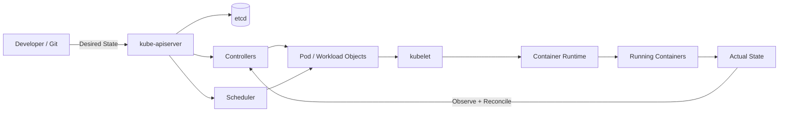
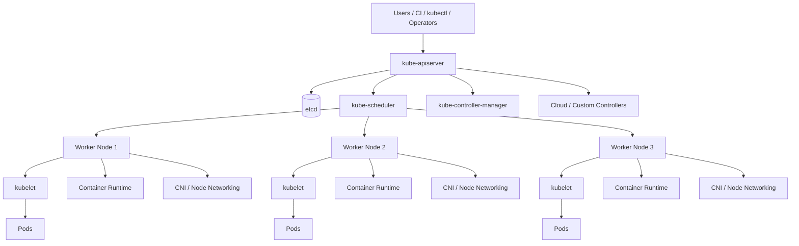
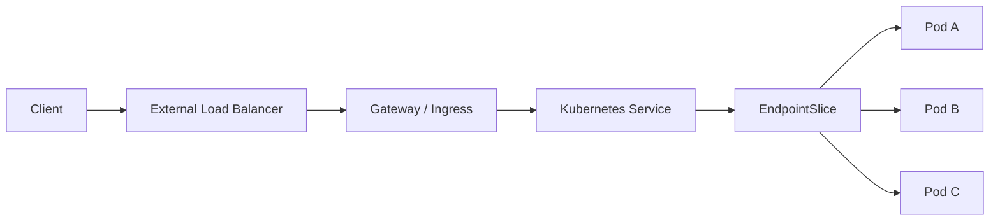
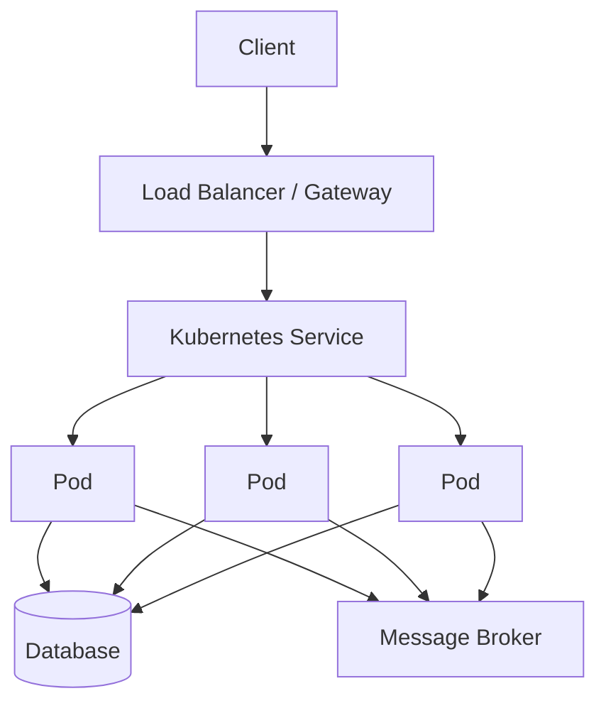
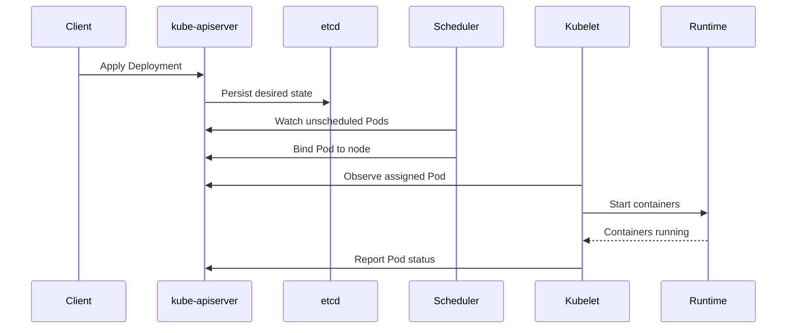

# Kubernetes Architecture & Interview Mastery

A practical, plain-English Kubernetes study guide focused on **architecture, production design, troubleshooting, and senior-level interview preparation**.

This repository accompanies the book **Kubernetes — Architecture, Production Design & Interview Mastery**. The goal is to build a strong mental model first, then connect Kubernetes objects and commands to the underlying control plane, node data plane, networking, storage, security, scaling, and reconciliation mechanisms.

## What This Book Covers

- Kubernetes mental model and declarative architecture
- Control plane and worker-node architecture
- kube-apiserver, etcd, scheduler, controllers, kubelet, and container runtime
- API objects, desired state, actual state, reconciliation, and admission
- Pods and container lifecycle
- Deployments, ReplicaSets, StatefulSets, DaemonSets, Jobs, and CronJobs
- Scheduling, requests, limits, taints, tolerations, affinity, and topology spread
- Kubernetes networking and CNI concepts
- Services, DNS, EndpointSlices, Ingress, and Gateway API
- PersistentVolumes, PersistentVolumeClaims, StorageClasses, and stateful workloads
- ConfigMaps, Secrets, and configuration patterns
- RBAC, ServiceAccounts, NetworkPolicies, admission controls, and workload security
- HPA, node autoscaling, availability, disruption budgets, and resilience
- Logging, metrics, tracing, health probes, and troubleshooting
- CI/CD, rolling deployments, blue-green and canary delivery, and GitOps
- Production Kubernetes architecture and platform patterns
- Multi-zone, multi-region, disaster recovery, RTO/RPO, and failure scenarios
- Senior-level architecture and system-design interview preparation
- kubectl and YAML cheat sheets
- 30-second interview explanations for common Kubernetes concepts

## Core Mental Model

The most important idea in the book is that Kubernetes is an **API-driven distributed control system**.

You declare what you want. Kubernetes stores that intent, controllers and the scheduler determine what should happen, node components execute it, and the system continuously observes and reconciles the difference between desired and actual state.



### The five concepts to remember

| Concept | Simple explanation |
|---|---|
| **Pod** | The smallest deployable and schedulable unit in Kubernetes. |
| **Workload Controller** | Keeps Pods running according to a higher-level desired state such as a Deployment or StatefulSet. |
| **Service** | Gives clients a stable network endpoint while Pod instances can change. |
| **Control Plane** | Accepts API requests, stores state, schedules workloads, and runs reconciliation controllers. |
| **Node** | Runs the Pods through kubelet, the container runtime, and the node networking stack. |

## Cluster Architecture

A production cluster separates the **control plane** from the **data plane**. The control plane coordinates the cluster; worker nodes execute application workloads.



## Book Structure

### 1. Kubernetes in One Mental Model

Introduces Kubernetes as a declarative control system and explains the relationship between desired state, actual state, controllers, scheduling, and reconciliation.

### 2. Kubernetes Cluster Architecture

Explains:

- kube-apiserver
- etcd
- kube-scheduler
- kube-controller-manager
- cloud/custom controllers
- kubelet
- container runtime
- node networking
- control-plane high availability

### 3. Kubernetes API and Declarative Model

Covers API resources, manifests, labels, selectors, namespaces, object metadata, admission, and the lifecycle of an API request.

### 4. Pods and Container Lifecycle

Explains Pod structure, containers, init containers, sidecars, Pod phases, restart behavior, termination, probes, and ephemeral workload behavior.

### 5. Workloads

Explains when to use each workload abstraction:

| Workload | Primary use |
|---|---|
| **Deployment** | Stateless applications and rolling updates |
| **StatefulSet** | Stable identity and persistent storage association |
| **DaemonSet** | One Pod per selected node or node group |
| **Job** | Run-to-completion batch processing |
| **CronJob** | Scheduled Jobs |

### 6. Scheduling and Resource Management

Covers:

- CPU and memory requests
- Limits
- Quality of Service classes
- Scheduler filtering and scoring concepts
- Node selectors
- Affinity and anti-affinity
- Taints and tolerations
- Topology spread constraints
- Resource pressure
- Capacity planning

### 7. Kubernetes Networking

Explains the Kubernetes network model, Pod IPs, node networking, CNI, Service networking, and common connectivity failure modes.

### 8. Services, DNS, Ingress, and Gateway API

Builds the request path from external traffic to a Pod and explains how Kubernetes provides stable service discovery and traffic routing.



The book emphasizes **Gateway API** for modern routing designs while still explaining **Ingress**, because Ingress remains widely encountered in existing environments.

### 9. Storage and Stateful Workloads

Explains the relationship between:

`StorageClass -> PersistentVolumeClaim -> PersistentVolume -> Storage Backend`

and discusses stateful applications, dynamic provisioning, access modes, reclaim behavior, and backup considerations.

### 10. Configuration and Secrets

Covers:

- ConfigMaps
- Secrets
- Environment variables
- Mounted configuration
- Secret exposure risks
- External secret-management patterns

### 11. Kubernetes Security

Covers the major layers of Kubernetes security:

- Authentication
- Authorization
- RBAC
- ServiceAccounts
- NetworkPolicy
- Admission controls
- Pod/workload security
- Image security
- Secret protection
- Least privilege

### 12. Scaling, Availability, and Resilience

Explains:

- Horizontal Pod Autoscaler
- Node autoscaling
- PodDisruptionBudget
- Multiple replicas
- Multi-zone placement
- Readiness and liveness design
- Graceful shutdown
- Failure domains
- Capacity headroom

### 13. Observability and Troubleshooting

A practical troubleshooting section covering:

- Pending Pods
- CrashLoopBackOff
- ImagePullBackOff
- 503 responses
- Service connectivity problems
- Failed rollouts
- Readiness failures
- Resource pressure
- Logs, metrics, and traces

A useful troubleshooting pattern is:

```text
Symptom
  -> Pod state
  -> Events
  -> Logs
  -> Readiness / liveness
  -> Service
  -> EndpointSlice
  -> NetworkPolicy / DNS
  -> Node / resource health
  -> Dependency health
```

### 14. CI/CD, GitOps, and Production Delivery

Explains how Kubernetes fits into modern delivery pipelines, including:

- Build and image promotion
- Manifest deployment
- Rolling updates
- Rollbacks
- Blue-green deployments
- Canary releases
- GitOps operating models
- Environment promotion
- Policy and security checks

### 15. Production Architecture Patterns

Shows how the individual Kubernetes concepts combine into production systems. It addresses:

- External traffic management
- Gateway and Service patterns
- Stateless microservices
- Message-driven workloads
- Databases and external stateful systems
- Multi-zone availability
- Observability
- Platform ownership
- Security boundaries
- Operational simplicity

### 16. Interview Masterclass

Contains core Kubernetes interview questions, scenario questions, architecture questions, and a framework for answering senior-level system-design problems.

The book encourages answering questions in this order:

```text
Requirement
   -> Scale
   -> Availability / RTO / RPO
   -> Workload type
   -> Networking
   -> Data / state
   -> Security
   -> Scaling
   -> Observability
   -> Failure modes
   -> Cost / trade-offs
```

## Interview Preparation

### 60-Second Kubernetes Architecture Answer

A strong answer should connect these pieces rather than listing components independently:

> Kubernetes is a declarative container orchestration platform. Clients interact with the kube-apiserver, which validates and persists cluster objects in etcd. Controllers continuously reconcile desired state, while the scheduler selects nodes for unscheduled Pods. On each node, kubelet works with the container runtime and networking stack to make the assigned Pod specification real. Services provide stable networking over changing Pods, and the platform adds scheduling, scaling, security, storage, and self-healing around the workload lifecycle.

### Core Interview Questions

1. Explain Kubernetes architecture in 60 seconds.
2. What is the role of kube-apiserver?
3. What does etcd store?
4. What does kube-scheduler do?
5. What is a controller?
6. Pod vs container?
7. Deployment vs StatefulSet?
8. Deployment vs DaemonSet?
9. Readiness vs liveness vs startup probe?
10. Requests vs limits?
11. Why is a Pod Pending?
12. What is a Service?
13. How does Service discovery work?
14. What is EndpointSlice?
15. Ingress vs Gateway API?
16. What is NetworkPolicy?
17. PV vs PVC vs StorageClass?
18. ConfigMap vs Secret?
19. How does RBAC work?
20. How does HPA work?
21. HPA vs node autoscaling?
22. What is a PodDisruptionBudget?
23. How do you troubleshoot CrashLoopBackOff?
24. How do you achieve zero-downtime deployment?
25. How would you design Kubernetes for disaster recovery?

## Production Scenario Questions

The book also includes practical scenarios such as:

- Pods are Running but users receive 503.
- A rollout is stuck at 60%.
- One availability zone is lost.
- CPU is low but application latency is high.
- HPA keeps scaling but the application remains slow.
- One service can reach the database while another cannot.
- A release cannot be rolled back because of a database-schema change.
- The business requires **RTO 2 minutes and RPO 5 minutes**.
- A Java microservice estate needs to scale by 10x during traffic spikes.
- A database must be protected from excessive concurrent connections.

## Architecture Patterns

### Stateless Microservice Pattern



### Control Plane to Node Execution



## Repository Layout

A recommended repository structure is:

```text
kubernetes-architecture-interview-mastery/
├── README.md
├── book/
│   └── Kubernetes_Architecture_Interview_Book_v2.docx
├── diagrams/
│   ├── cluster-architecture.md
│   ├── request-flow.md
│   ├── workload-lifecycle.md
│   └── production-architecture.md
├── examples/
│   ├── deployment.yaml
│   ├── service.yaml
│   ├── configmap.yaml
│   ├── secret.yaml
│   └── hpa.yaml
└── notes/
    └── interview-questions.md
```

## How to Study This Book

### Phase 1 — Build the Mental Model

Understand these first:

`API Server -> etcd -> Controllers / Scheduler -> Kubelet -> Runtime -> Pods`

Do not start by memorizing kubectl commands.

### Phase 2 — Understand Workloads

Be able to explain why you would choose:

`Deployment | StatefulSet | DaemonSet | Job | CronJob`

### Phase 3 — Trace a Request

Practice explaining:

`Client -> Load Balancer -> Gateway/Ingress -> Service -> EndpointSlice -> Pod`

### Phase 4 — Trace a Failure

Practice questions such as:

- Why is the Pod Pending?
- Why did the Pod restart?
- Why does the Service have no endpoints?
- Why is the Service returning 503?
- Why is the application slow even though CPU is low?

### Phase 5 — Design Production Systems

Add:

- Multi-zone placement
- Autoscaling
- Resource controls
- Security
- Observability
- Rollouts and rollback
- Backup and DR
- Cost considerations

### Phase 6 — Practice Senior-Level Answers

For architecture questions, avoid simply naming Kubernetes objects. Explain **why** each object exists, what failure it handles, and what trade-off it introduces.

## Example Deployment

```yaml
apiVersion: apps/v1
kind: Deployment
metadata:
  name: orders
spec:
  replicas: 3
  selector:
    matchLabels:
      app: orders
  template:
    metadata:
      labels:
        app: orders
    spec:
      containers:
        - name: orders
          image: example/orders:1.0.0
          ports:
            - containerPort: 8080
          resources:
            requests:
              cpu: "250m"
              memory: "512Mi"
            limits:
              cpu: "1"
              memory: "1Gi"
          readinessProbe:
            httpGet:
              path: /ready
              port: 8080
          livenessProbe:
            httpGet:
              path: /health
              port: 8080
```

## Useful kubectl Commands

```bash
# Cluster
kubectl get nodes -o wide
kubectl cluster-info
kubectl get namespaces

# Workloads
kubectl get deploy,rs,pods -A
kubectl rollout status deployment/orders
kubectl rollout history deployment/orders
kubectl rollout undo deployment/orders

# Pods
kubectl describe pod <pod-name>
kubectl logs <pod-name>
kubectl logs <pod-name> --previous
kubectl exec -it <pod-name> -- sh

# Networking
kubectl get svc,endpointslice
kubectl describe svc <service-name>
kubectl get networkpolicy -A
```

## Recommended Learning Principle

Do not memorize Kubernetes as a list of YAML fields.

Instead, repeatedly ask:

**What is the desired state?**

**Where is that state stored?**

**Which controller or component acts on it?**

**What happens on the node?**

**How is actual state observed?**

**What happens when something fails?**

That reasoning pattern is the foundation for both production Kubernetes engineering and senior architecture interviews.

## Official References

- [Kubernetes Documentation — Architecture](https://kubernetes.io/docs/concepts/architecture/)
- [Kubernetes Documentation — Workloads and Controllers](https://kubernetes.io/docs/concepts/workloads/controllers/)
- [Kubernetes Documentation — Services and Networking](https://kubernetes.io/docs/concepts/services-networking/)
- [Kubernetes Documentation — Ingress](https://kubernetes.io/docs/concepts/services-networking/ingress/)
- [Kubernetes Documentation — Gateway API](https://kubernetes.io/docs/concepts/services-networking/gateway/)
- [Kubernetes Documentation — Deployments](https://kubernetes.io/docs/concepts/workloads/controllers/deployment/)
- [Kubernetes Documentation — StatefulSets](https://kubernetes.io/docs/concepts/workloads/controllers/statefulset/)

## Book

**Kubernetes — Architecture, Production Design & Interview Mastery**

Includes detailed explanations, Mermaid architecture diagrams, practical examples, troubleshooting scenarios, and interview questions for software engineers, cloud engineers, solution architects, and technical interview candidates.
