# Kubernetes Interview Guide: Top 10 Questions with Production Examples and STAR Answers

> **Audience:** Senior Software Engineer, Java Lead, GCP Solution Architect, Cloud Engineer, and Kubernetes/GKE interview candidates.
>
> This guide focuses on **what Kubernetes does, why the feature matters, how it behaves in production, and how to explain the decision using a STAR-style answer**.

## How to Use This Guide

For each interview question, use the following progression:

```text
What is it?
   ↓
Why do we need it?
   ↓
How does it work?
   ↓
Production example
   ↓
Design consideration / trade-off
   ↓
STAR answer
```

The goal is to demonstrate **technical knowledge + architecture judgment + production experience**.

## Table of Contents

1. [Kubernetes Architecture](#1-explain-kubernetes-architecture)
2. [Pods](#2-what-is-a-pod-and-why-dont-we-deploy-containers-directly)
3. [Deployment vs ReplicaSet vs Pod](#3-deployment-vs-replicaset-vs-pod)
4. [Services](#4-what-is-a-kubernetes-service)
5. [Ingress](#5-what-is-ingress)
6. [ConfigMap vs Secret](#6-configmap-vs-secret)
7. [Requests and Limits](#7-explain-requests-and-limits)
8. [Health Probes](#8-liveness-vs-readiness-vs-startup-probe)
9. [Affinity, Anti-Affinity, Taints and Tolerations](#9-explain-affinity-anti-affinity-taints-and-tolerations)
10. [Scaling and Self-Healing](#10-explain-hpa-cluster-autoscaler-and-self-healing)
11. [End-to-End GKE Design Scenario](#bonus-one-end-to-end-interview-scenario)
12. [STAR Interview Pattern](#the-star-pattern-you-should-use)

---

# 1. Explain Kubernetes Architecture

## How I would explain it in an interview

Kubernetes is a **declarative container orchestration platform**. Its main responsibility is to make the actual environment match the desired state defined by the application team.

For example, I might define:

```yaml
replicas: 3
```

That means:

> “I want three instances of my application running.”

Kubernetes continuously monitors the cluster and tries to make that true.

The architecture has two major parts:

```text
                    Kubernetes Cluster
                           |
          ┌────────────────┴────────────────┐
          │                                 │
     Control Plane                     Worker Nodes
          │                                 │
   ┌──────┼──────────┐              ┌───────┼────────┐
   │      │          │              │       │        │
 API   Scheduler  Controllers      Kubelet  Runtime  kube-proxy
Server  Manager    Manager           │
   │                                 ↓
   │                               Pods
   ↓
 etcd
```

### Control Plane

### API Server

The API Server is the **entry point into Kubernetes**.

When I execute:

```bash
kubectl apply -f deployment.yaml
```

the request goes through the API Server.

It handles:

- Authentication
- Authorization
- Admission control
- Kubernetes API requests

It then persists the desired state.

---

### etcd

`etcd` stores the Kubernetes cluster state.

For example:

```text
Deployment = payment-service
Desired replicas = 5
Service = payment-service
ConfigMaps
Secrets
Nodes
RBAC
```

Think of it as the cluster's **source of truth**.

---

### Scheduler

The scheduler decides:

> “Which worker node should run this Pod?”

It considers:

```text
CPU / Memory requests
Node affinity
Pod affinity
Pod anti-affinity
Taints
Tolerations
Topology constraints
Node availability
```

For example:

```text
Pod requires:
CPU = 2
Memory = 4 GB

Node A:
1 CPU available → reject

Node B:
8 CPU available → candidate
```

---

### Controller Manager

Controllers implement the Kubernetes reconciliation model.

Suppose:

```text
Desired = 3 Pods
Actual  = 2 Pods
```

The controller notices the difference and creates another Pod.

So Kubernetes is continuously doing:

```text
Desired state
     ↓
Compare
     ↓
Actual state
     ↓
Take corrective action
```

---

### Worker Node

The worker node actually runs the workloads.

**Kubelet**

The kubelet communicates with the control plane and ensures assigned Pods are running.

**Container runtime**

Runs the containers.

**Networking components**

Provide connectivity between Pods, Services, and external systems.

---

## Production example

Imagine your GCP application:

```text
Internet
   ↓
Google Cloud Load Balancer
   ↓
Ingress / Gateway
   ↓
GKE Service
   ↓
Java Spring Boot Pods
   ↓
Pub/Sub / Spanner / BigQuery
```

Kubernetes manages:

```text
Deployment
Pod lifecycle
Scaling
Scheduling
Health checks
Rolling deployments
Self-healing
```

while GCP provides infrastructure and managed services.

---

## STAR Answer

### Situation

> “At Ford, we had distributed services running as containerized workloads, and we needed a reliable platform that could handle application scaling, self-healing, and deployment across multiple zones.”

### Task

> “My responsibility was to design the workload deployment model so that services could scale independently, remain available during node failures, and support controlled application releases.”

### Action

> “I used GKE as the orchestration platform. I separated the workload into Deployments and Services, configured resource requests and limits, readiness and liveness probes, and used node and pod placement rules for high availability. I also designed the deployment pipeline so application changes were promoted through controlled rolling updates.”

### Result

> “The result was a more resilient platform where failed Pods were automatically recreated, workloads could scale independently, and deployments could happen without taking the entire service offline.”

### Strong closing statement

> “The important thing about Kubernetes for me is not just containers; it's the reconciliation model. I define the desired state, and Kubernetes continuously works to maintain it.”

---

# 2. What is a Pod, and why don't we deploy containers directly?

## What is a Pod?

A Pod is the **smallest deployable and schedulable unit in Kubernetes**.

A Pod can contain one or more containers.

Most applications use:

```text
Pod
 └── Application container
```

But a Pod can also contain:

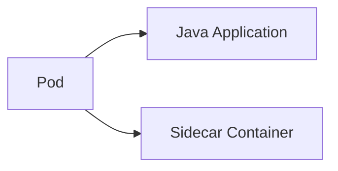

Containers within a Pod share:

- Network namespace
- Pod IP address
- Volumes
- Lifecycle

For example:

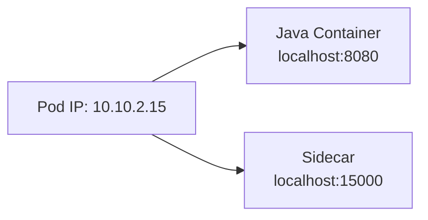

Both are inside the same network namespace.

---

## Why Pod instead of container?

Kubernetes needs a unit that can represent:

> “These containers must be scheduled, networked, and managed together.”

For example, a logging sidecar may need to run with the application:

```text
Pod
 ├── Application
 └── Logging sidecar
```

Kubernetes schedules the **Pod**, not individual containers.

---

## Important point

Pods are ephemeral.

Don't design your application around a fixed Pod IP.

Instead:

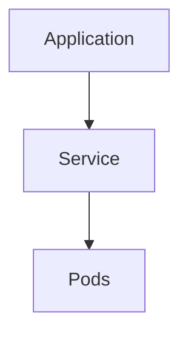

When a Pod dies:

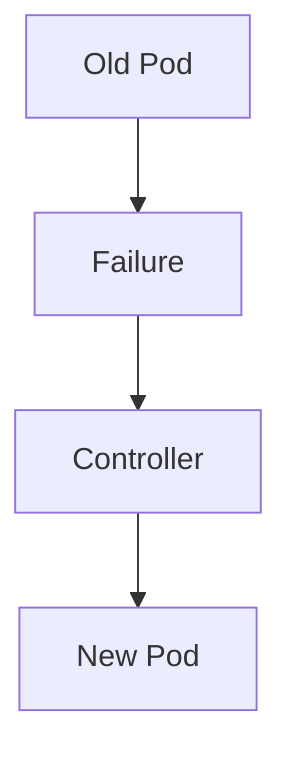

The replacement Pod can have a different IP and identity.

---

## STAR Answer

### Situation

> “In one of my microservices environments, we had multiple independently deployable Java services running as containers.”

### Task

> “We needed a platform abstraction that could manage those containers, provide networking, health management, and allow Kubernetes to schedule them consistently.”

### Action

> “I deployed the services as Pods managed through Deployments rather than treating individual containers as the scheduling unit. For applications requiring supporting functionality, I used the Pod model to colocate tightly coupled sidecars and share networking or volumes.”

### Result

> “That gave us a predictable deployment and lifecycle model. Kubernetes could reschedule entire application units when nodes failed, while Services abstracted away changing Pod IP addresses.”

### Interview insight

> “I always treat Pods as ephemeral and Services as the stable communication endpoint.”

---

# 3. Deployment vs ReplicaSet vs Pod

This is a very important architectural relationship:

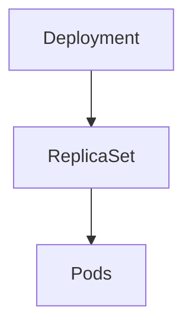

## Pod

Runs the actual application.

```text
Pod → Java application
```

## ReplicaSet

Maintains the required number of Pods.

If:

```text
replicas = 3
```

and one Pod dies:

```text
3 desired
2 current
   ↓
ReplicaSet creates another Pod
```

---

## Deployment

Deployment manages application releases and ReplicaSets.

It provides:

- Rolling updates
- Rollback
- Scaling
- ReplicaSet management
- Revision history

Example:

```text
Deployment

v1 ReplicaSet
  ↓
Pod
Pod
Pod

During deployment

v1 ReplicaSet
  ↓
Pod Pod

v2 ReplicaSet
  ↓
Pod Pod
```

Eventually:

```text
v2
Pod
Pod
Pod
```

---

## Why not directly create Pods?

Because direct Pods don't give you the application-level lifecycle management you normally need.

Instead:


---

## STAR Answer

### Situation

> “We had Java microservices that needed frequent releases without interrupting production traffic.”

### Task

> “I needed a deployment mechanism that would maintain the desired replica count while allowing controlled version changes and rollback.”

### Action

> “I used Kubernetes Deployments. The Deployment managed ReplicaSets, and ReplicaSets maintained the desired number of Pods. For releases, I used rolling updates with appropriate availability settings and rollout monitoring.”

### Result

> “We could deploy newer versions gradually, maintain application availability, and quickly roll back if the new version introduced problems.”

### Strong statement

> “I use Deployments for stateless services because they combine replica management and release management rather than just running individual Pods.”

---

# 4. What is a Kubernetes Service?

## The problem

Pods are temporary.

Suppose:

```text
payment-1 → 10.1.1.10
payment-2 → 10.1.1.11
payment-3 → 10.1.1.12
```

Pod `payment-2` crashes.

The new Pod might become:

```text
payment-4 → 10.1.1.25
```

Therefore, applications cannot rely on Pod IP addresses.

---

# Service solves this

A Service provides a stable abstraction:

```text
             payment-service
                    |
             ┌──────┼──────┐
             ↓      ↓      ↓
          Pod-1   Pod-2   Pod-3
```

Applications communicate with:

```text
payment-service
```

instead of:

```text
10.1.1.10
10.1.1.11
10.1.1.12
```

The Service selects Pods using labels.

```yaml
selector:
  app: payment
```

---

## Common Service types

### ClusterIP

Internal service communication.

```text
order-service
      ↓
payment-service
      ↓
payment Pods
```

### NodePort

Exposes a service through a port on nodes.

### LoadBalancer

Used when a cloud load balancer should expose the Service externally.

On GKE, this can integrate with Google Cloud load-balancing infrastructure.

### Headless Service

```yaml
clusterIP: None
```

Used when applications need direct access to Pod endpoints rather than a single virtual service IP.

---

## Service vs Ingress

This is a good interview distinction.

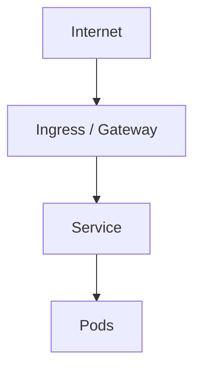

Ingress or Gateway handles external HTTP routing.

Service provides the stable service endpoint and backend selection.

---

## STAR Answer

### Situation

> “Our microservices communicated with one another, but Pods were frequently recreated during deployments and failures.”

### Task

> “We needed stable service discovery without coupling consumers to Pod IP addresses.”

### Action

> “I exposed each application through a Kubernetes Service and used label selectors to dynamically identify the healthy backend Pods. External HTTP traffic was routed through the ingress/load-balancing layer, while internal microservice communication used ClusterIP services.”

### Result

> “Applications remained decoupled from Pod lifecycle. Pods could be recreated or scaled horizontally without requiring changes to consumers.”

### Strong statement

> “A Service provides stable identity while Pods provide the actual compute.”

---

# 5. What is Ingress?

Ingress addresses a different problem:

> “How does external HTTP/HTTPS traffic enter my Kubernetes environment and reach the correct service?”

For example:

```text
                        Internet
                           ↓
                      Load Balancer
                           ↓
                         Ingress
                       /         \
                      /           \
                 /orders         /users
                    ↓               ↓
              order-service    user-service
                    ↓               ↓
                  Pods             Pods
```

Instead of exposing every service individually, you can centralize HTTP routing.

---

## Example

Request:

```text
https://company.com/orders
```

goes to:

```text
order-service
```

while:

```text
https://company.com/users
```

goes to:

```text
user-service
```

---

## GCP architecture

In a GCP environment, you might have:

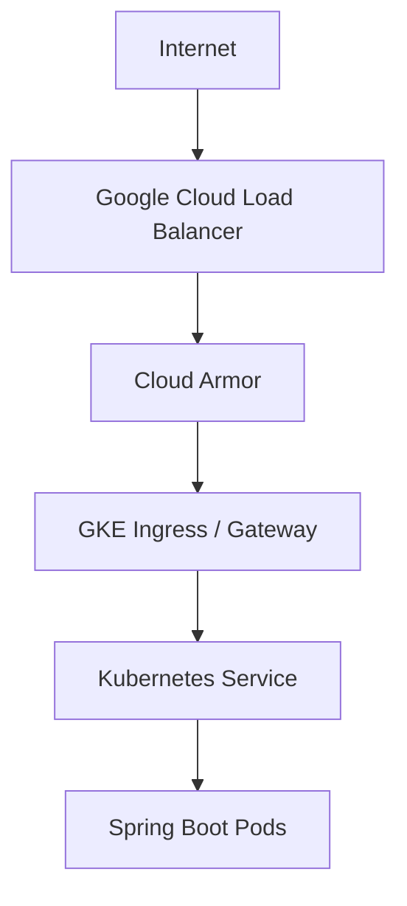

Depending on requirements, Apigee may sit in front of APIs as well:

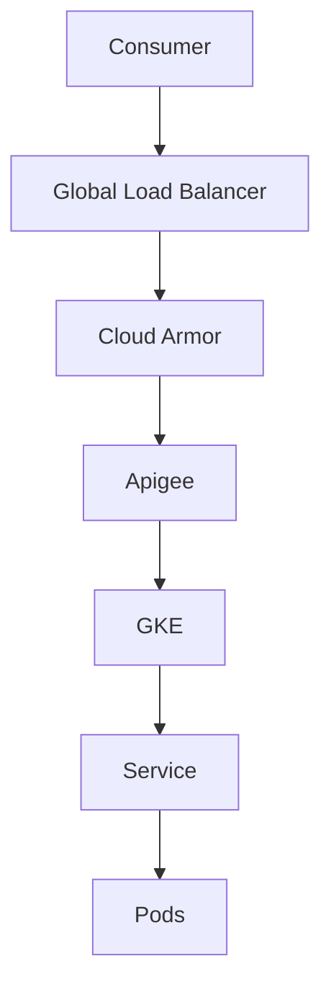

---

## STAR Answer

### Situation

> “We had multiple microservices that needed to be accessed through common external HTTP endpoints.”

### Task

> “I needed to expose these services securely without provisioning a separate public endpoint for every microservice.”

### Action

> “I used the Kubernetes ingress or Gateway layer to route requests based on host and path rules. Security controls such as TLS termination and WAF protection were implemented at the edge, and requests were routed to internal Kubernetes Services.”

### Result

> “This gave us centralized routing, consistent security enforcement, and simpler service exposure while keeping individual Pods private.”

### Architect-level statement

> “I don't expose every microservice directly. I prefer a controlled north-south entry point and keep east-west communication internal.”

---

# 6. ConfigMap vs Secret

Applications need configuration, but configuration shouldn't be hardcoded in the image.

For example:

```text
DB_HOST
LOG_LEVEL
FEATURE_FLAG
```

can be configuration.

---

## ConfigMap

Stores non-sensitive configuration.

```yaml
data:
  LOG_LEVEL: INFO
  DB_HOST: spanner.example
```

The application can consume it as:

```text
Environment variable
        or
Configuration file
```

---

## Secret

Used for sensitive values such as:

```text
Password
Token
Certificate
API key
```

However, an important interview detail:

> Kubernetes Secrets are not automatically equivalent to a dedicated external secrets management system.

They should be protected using appropriate RBAC and encryption-at-rest configuration.

---

## GCP architecture

In GCP I would often prefer:

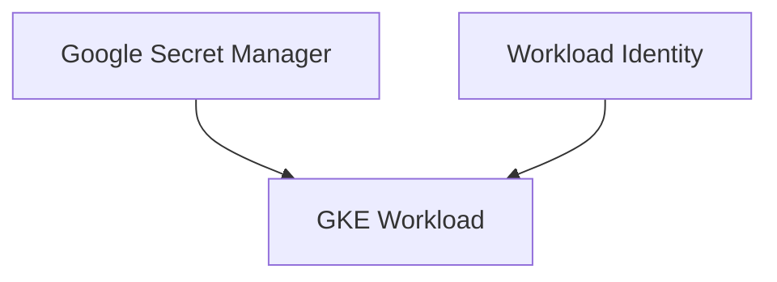

instead of managing long-lived credentials manually.

For example:

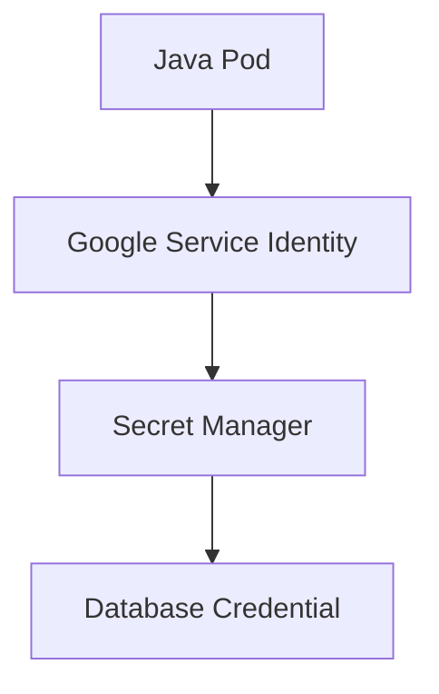

This reduces the risk of embedding credentials in images or manifests.

---

## STAR Answer

### Situation

> “Our services required environment-specific configuration and access to sensitive credentials.”

### Task

> “We needed to separate configuration from application code while preventing sensitive values from being hardcoded.”

### Action

> “I separated non-sensitive settings into ConfigMaps and sensitive credentials into managed secret storage. In GCP, I prefer Secret Manager integrated with workload identity so workloads don't depend on static credentials stored in application configuration.”

### Result

> “This made deployments environment-independent and improved security by eliminating hardcoded credentials and reducing credential management overhead.”

### Strong statement

> “Configuration belongs outside the image, and credentials should have the smallest possible lifetime and privilege.”

---

# 7. Explain Requests and Limits

This is a very important Kubernetes production question.

Suppose:

```yaml
resources:
  requests:
    cpu: "500m"
    memory: "512Mi"

  limits:
    cpu: "1"
    memory: "1Gi"
```

## Request

Request means:

> “This is the amount of capacity Kubernetes should reserve/consider when scheduling the Pod.”

For CPU:

```text
500m = 0.5 CPU
```

The scheduler checks whether a node can satisfy the request.

---

## Limit

Limit says:

> “Don't allow the container to consume beyond this configured maximum.”

For example:

```text
CPU request = 500m
CPU limit   = 1

Memory request = 512Mi
Memory limit   = 1Gi
```

---

## Why this matters

Imagine:

```text
1,000 incoming requests
        ↓
Application
        ↓
Unlimited resource consumption
        ↓
Node exhaustion
```

Resource requests and limits provide predictable scheduling and resource control.

---

## CPU vs Memory

A useful interview distinction:

**CPU**

When the container reaches its CPU limit, CPU usage can be throttled.

**Memory**

Exceeding a memory limit can result in an OOM-related termination.

---

## Production example

Suppose your Java service normally uses:

```text
500m CPU
768Mi memory
```

but during load:

```text
CPU → 2 cores
Memory → 1.2 GB
```

You need to choose values based on **actual workload behavior**, not arbitrary numbers.

This is where observability becomes important.

---

## STAR Answer

### Situation

> “We had multiple microservices sharing GKE nodes, and some workloads had unpredictable resource consumption.”

### Task

> “I needed to prevent one service from consuming excessive node capacity and affecting other workloads.”

### Action

> “I established resource requests and limits based on measured CPU and memory behavior. Requests were used to drive scheduling decisions, while limits prevented runaway resource usage. I also monitored the workload so the values could be adjusted based on production behavior rather than guesswork.”

### Result

> “The cluster had more predictable scheduling behavior, improved resource utilization, and reduced the risk of noisy-neighbor problems.”

### Strong statement

> “Requests are primarily about scheduling; limits are about runtime resource governance.”

---

# 8. Liveness vs Readiness vs Startup Probe

This is one of the most frequently asked practical questions.

The easiest way to remember:

```text
Startup
"Has it started?"

Readiness
"Can it receive traffic?"

Liveness
"Is it still healthy enough to keep running?"
```

---

# Startup Probe

Imagine a Java application takes 90 seconds to start because it loads configuration and initializes clients.

During startup:

```text
Pod = Running
Application = initializing
```

A liveness check shouldn't kill it prematurely.

Startup probe allows Kubernetes to give the application time to initialize.

---

# Readiness Probe

Readiness answers:

> “Should traffic be sent to this Pod?”

Example:

```text
Pod started
      ↓
Java application initializing
      ↓
Readiness = false
      ↓
Service does not send traffic
```

Once ready:

```text
Readiness = true
      ↓
Pod becomes a service endpoint
```

---

# Liveness Probe

Liveness answers:

> “Is the application still alive?”

Suppose a Java application becomes permanently stuck:

```text
Application process still exists
but
application is not functioning
```

Liveness can detect the failure and Kubernetes can restart the container.

---

## Very important interview distinction

Don't use liveness to answer:

> “Can this application serve traffic?”

That's readiness.

---

## STAR Answer

### Situation

> “One of our Spring Boot services had a relatively long initialization time and could also experience runtime failures where the process remained alive but was no longer serving requests.”

### Task

> “We needed Kubernetes to distinguish startup behavior, traffic readiness, and actual application health.”

### Action

> “I configured a startup probe to protect the initialization period, a readiness probe to control whether the Service should send traffic, and a liveness probe to detect unrecoverable application states.”

### Result

> “This prevented premature restarts during startup and ensured unhealthy instances were removed from traffic while failed containers could still be automatically recovered.”

### Strong statement

> “Readiness protects the user; liveness protects the process.”

---

# 9. Explain Affinity, Anti-Affinity, Taints and Tolerations

These are all about **where Pods should run**.

---

# Node Affinity

Pod says:

> “I want to run on nodes having these characteristics.”

Example:

```text
workload=gpu
```

or:

```text
disk=ssd
```

```text
GPU node pool
     ↑
Node affinity
     ↑
GPU workload
```

---

# Pod Affinity

Pod says:

> “Place me near certain other Pods.”

Example:

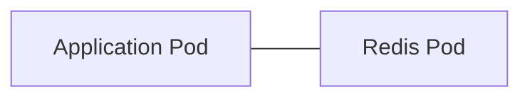

possibly in the same zone.

---

# Pod Anti-Affinity

Pod says:

> “Don't place me together with these Pods.”

For high availability:

```text
Zone A → API-1
Zone B → API-2
Zone C → API-3
```

rather than:

```text
Zone A
 ├── API-1
 ├── API-2
 └── API-3
```

---

# Taint

Node says:

> “Don't schedule workloads here unless they explicitly tolerate my taint.”

Example:

```text
GPU node
taint:
gpu=true:NoSchedule
```

---

# Toleration

Pod says:

> “I am allowed to run on this node.”

Important:

**Toleration does not guarantee placement.**

It merely allows the Pod to tolerate the node's taint.

You may still need **node affinity** to ensure the Pod actually chooses the desired GPU nodes.

---

# Excellent GKE example

Suppose your GKE cluster has:

```text
General node pool
GPU node pool
```

You don't want normal Java applications consuming GPU nodes.

You can configure:

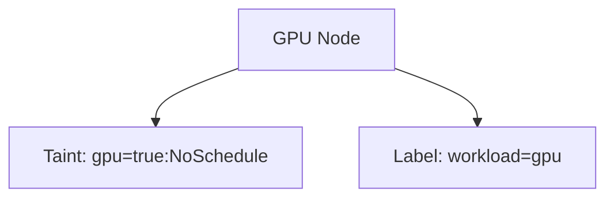

Then the GPU workload gets:

```text
Toleration
     +
Node affinity
```

So:

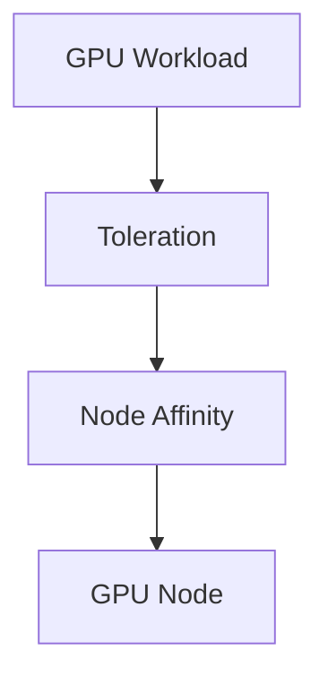

---

## STAR Answer

### Situation

> “We had different workload types with very different infrastructure requirements, including general application workloads and specialized compute workloads.”

### Task

> “I needed to prevent workload interference and ensure specialized workloads were placed on the appropriate nodes.”

### Action

> “I separated the workloads using node pools. I used taints and tolerations to prevent unintended workloads from entering specialized nodes and node affinity to explicitly select the correct node characteristics. For replicas of critical services, I used pod anti-affinity and topology rules to distribute instances.”

### Result

> “Workloads were isolated more effectively, specialized capacity was used efficiently, and application replicas were more resilient to node-level failures.”

### Strong statement

> “Taints are a node-side exclusion mechanism; affinity is a Pod-side placement mechanism.”

---

# 10. Explain HPA, Cluster Autoscaler and Self-Healing

This is a very strong architect-level question.

There are actually several independent control loops.

---

# Self-Healing

Suppose:

```text
Desired replicas = 3
```

Current state:

```text
Pod A
Pod B
Pod C
```

Pod B crashes.

Kubernetes detects:

```text
Desired = 3
Actual = 2
```

Controller creates:

```text
Pod D
```

Now:

```text
A B C/D
```

and eventually three healthy replicas exist.

That's the reconciliation model.

---

# HPA

Horizontal Pod Autoscaler scales **Pods**.

For example:

```text
CPU utilization
       ↓
      80%
       ↓
HPA
       ↓
3 Pods → 6 Pods
```

So:

```text
HPA = Pod scaling
```

---

# Cluster Autoscaler

Now imagine HPA creates:

```text
20 additional Pods
```

but the cluster doesn't have enough capacity.

Some Pods remain:

```text
Pending
```

Cluster Autoscaler can increase node capacity:

```text
10 nodes
   ↓
15 nodes
```

So:

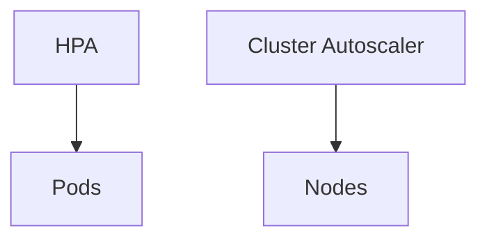

---

# Vertical Pod Autoscaler

VPA focuses on **resource sizing**.

For example:

```text
Current CPU request:
250m

Observed workload:
800m

VPA recommendation:
~800m
```

VPA requires careful architecture when used together with HPA, particularly if both are trying to influence the same resource dimensions.

---

# Production scaling architecture

For your GCP/GKE environment:

```text
                User Traffic
                     ↓
              Load Balancer
                     ↓
                  Service
                     ↓
               Java Pods
                     ↓
             HPA monitors metrics
                     ↓
            5 Pods → 15 Pods
                     ↓
         Node capacity insufficient
                     ↓
          Cluster Autoscaler
                     ↓
          Additional GKE nodes
```

---

## STAR Answer

### Situation

> “We had variable traffic patterns where application load could increase significantly during peak business activity.”

### Task

> “I needed the platform to scale the application automatically while maintaining predictable resource utilization and avoiding unnecessary infrastructure cost.”

### Action

> “I used HPA to scale the number of application replicas based on workload metrics. I ensured resource requests were correctly defined because they influence scheduling and autoscaling behavior. When the cluster reached capacity, node autoscaling provided additional compute capacity.”

### Result

> “The application could absorb traffic spikes without manual intervention, while infrastructure scaled back when demand decreased, improving both resilience and cost efficiency.”

### Strong architect answer

> “I think about scaling at two levels: HPA answers how many application instances I need, while node autoscaling answers whether the cluster has enough physical capacity to run them.”

---

# Bonus: One End-to-End Interview Scenario

This is probably the most useful part for your interviews.

Suppose the interviewer asks:

> **“Design a highly available Java microservice on GKE.”**

A strong answer would connect all ten concepts:

```text
                         Internet
                            |
                            ↓
                 Global Load Balancer
                            |
                       Cloud Armor
                            |
                     Ingress / Gateway
                            |
                         Service
                            |
              ┌─────────────┼─────────────┐
              ↓             ↓             ↓
           Pod-1         Pod-2         Pod-3
          Zone A         Zone B        Zone C
             |             |             |
             └─────────────┼─────────────┘
                           |
                     Java Spring Boot
                           |
             ┌─────────────┼─────────────┐
             ↓             ↓             ↓
          Pub/Sub       Spanner       BigQuery
```

And I would explain:

> “I would deploy the Java service using a Kubernetes Deployment, with multiple replicas distributed across zones using pod anti-affinity or topology spread constraints. A Kubernetes Service provides stable discovery, while Gateway or Ingress handles north-south HTTP routing. I would configure readiness, liveness and startup probes so traffic is only sent to healthy Pods. Resource requests and limits provide predictable scheduling and resource governance. HPA handles Pod scaling, while GKE node autoscaling handles capacity scaling. For specialized workloads I would use node affinity with taints and tolerations. Sensitive configuration would be kept outside the container image, preferably using GCP Secret Manager with workload identity.”

That answer sounds much more like a **Solution Architect** than someone who has only memorized Kubernetes commands.

---

# The STAR Pattern You Should Use

For Kubernetes interview questions, don't give STAR before explaining the technology.

Use this structure:

```text
1. What is it?
        ↓
2. Why do we need it?
        ↓
3. How does it work?
        ↓
4. Production example
        ↓
5. Trade-off / design consideration
        ↓
6. STAR experience
```

For example:

> **“What is Pod anti-affinity?”**

Don't answer only:

> “It prevents Pods from running together.”

Instead:

> “Pod anti-affinity is a scheduling mechanism that lets me avoid placing related Pods in the same topology domain. I typically use it for highly available replicas. For example, if I have three Spring Boot replicas, I can distribute them across nodes or zones so that a node or zone failure doesn't remove all replicas. In production, I combine this with topology constraints and multiple GKE zones.”

Then give your STAR scenario.

That combination demonstrates **knowledge + judgment + experience**, which is what senior-level interviewers are looking for.

---

## Final Interview Reminder

For senior Kubernetes interviews, do more than define the feature. Connect each Kubernetes capability to:

- **Availability**
- **Scalability**
- **Security**
- **Networking**
- **Resource management**
- **Failure recovery**
- **Operational simplicity**
- **Cost**

The strongest answer is usually:

> **Definition → Why it matters → Production design → Trade-off → STAR experience.**
