# Application Architecture Assurance Framework

## Quality, Observability, Performance, Reliability & Operational Readiness

> **POC Architecture Strategy**

---

# 1. Executive Summary

The objective of the Proof of Concept (POC) is not only to validate functional capabilities. It is also to establish measurable architectural baselines for:

- Observability
- Performance and scalability
- Reliability and resilience
- Software quality
- Disaster recovery
- Operational readiness

The architecture approach translates **business requirements, functional requirements, non-functional requirements (NFRs), RTO, and RPO** into:

1. Architecture decisions
2. Measurable Service Level Objectives (SLOs)
3. Service Level Indicators (SLIs)
4. Operational metrics
5. Automated validation mechanisms
6. Production readiness criteria

The core architectural principle is:

> **Every critical NFR should have an architectural implementation, a measurable metric, and a validation mechanism.**

---

# 2. Architecture Assurance Model

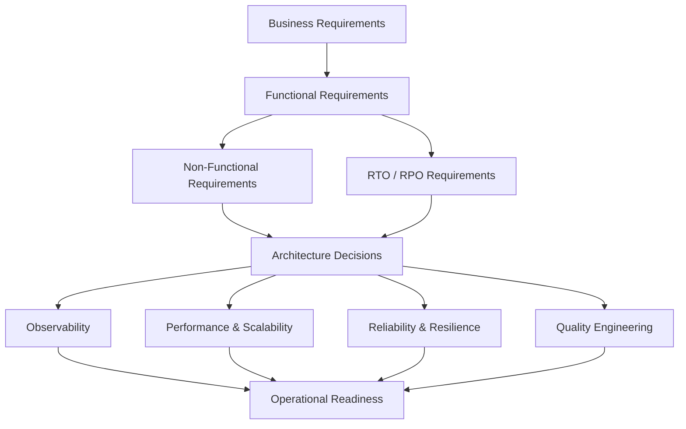

The architecture assurance process follows:

```text
Requirement
    ↓
Architecture Decision
    ↓
Implementation
    ↓
Measurement
    ↓
Validation
    ↓
Operational Readiness
```

---

# 3. Architecture Overview

## Application Architecture

The current solution architecture includes:

- Angular UI
- Cloud CDN
- Global Load Balancer
- Apigee
- Spring Boot REST APIs
- Cloud Run
- Cloud Spanner
- Cloud SQL
- Cloud Storage
- Dataflow

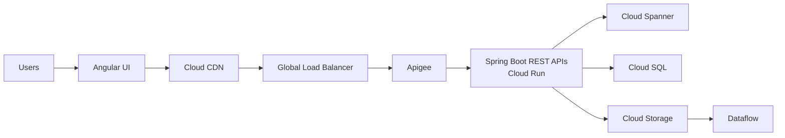

---

# 4. Architecture Strategy

The architecture is evaluated across five primary pillars.

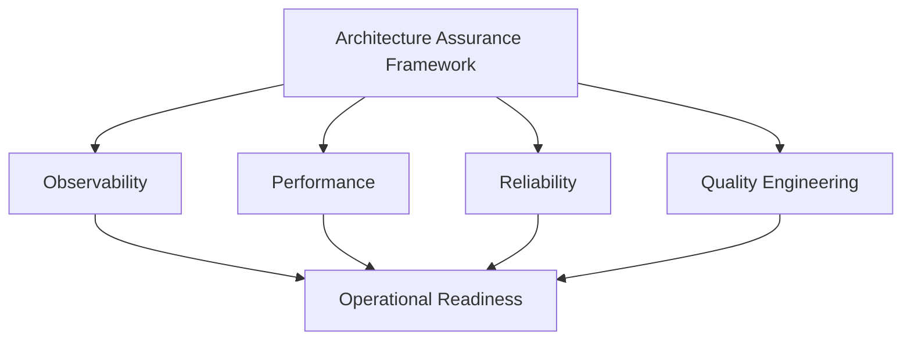

## Architecture Assurance Pillars

| Pillar | Objective |
|---|---|
| Observability | Understand application health and diagnose failures |
| Performance | Validate latency, throughput, and scalability |
| Reliability | Prevent, detect, and recover from failures |
| Quality | Ensure software meets functional and quality standards |
| Operational Readiness | Ensure the application can be safely operated in production |

---

# 5. POC Objectives

The POC should not attempt to implement every production capability.

Instead, the objective is:

> **The POC will validate architectural assumptions and establish measurable baselines that drive future production architecture decisions.**

## Short-Term Objectives

### 1. Define measurable NFRs

Convert business and technical requirements into measurable targets.

### 2. Establish observability

Implement logs, metrics, traces, dashboards, and alerts.

### 3. Establish performance baselines

Measure latency, throughput, resource utilization, and scalability.

### 4. Validate reliability

Identify failure scenarios and recovery mechanisms.

### 5. Establish quality gates

Define automated testing and release validation.

### 6. Map RTO and RPO

Translate recovery requirements into component-level architecture decisions.

---

# 6. NFR Traceability Framework

A critical architecture deliverable is the **NFR Traceability Matrix**.

The objective is to ensure that every important requirement has:

```text
Requirement
      ↓
Architecture Decision
      ↓
Implementation
      ↓
Metric
      ↓
Validation
```

## Example

| ID | Requirement | Architecture Decision | Metric | Validation |
|---|---|---|---|---|
| PERF-01 | p95 API latency < X ms | Cloud Run autoscaling | p95 latency | Load test |
| REL-01 | Availability target | Multi-instance architecture | Availability | SLO monitoring |
| DR-01 | RTO = X | Recovery strategy | Recovery time | DR test |
| DR-02 | RPO = X | Backup strategy | Data loss | DR test |
| OBS-01 | Request traceability | OpenTelemetry | Trace coverage | Integration test |

---

# 7. Example NFR Translation

An architect should not simply document a requirement.

The requirement should drive architecture decisions.

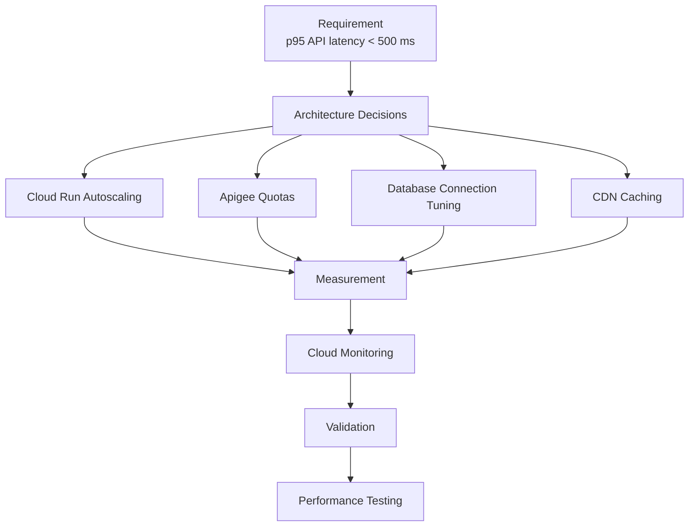

---

# 8. Observability Strategy

Observability answers the following question:

> **How do we know whether the application is healthy, and how do we diagnose failures?**

The observability strategy is based on three primary pillars.

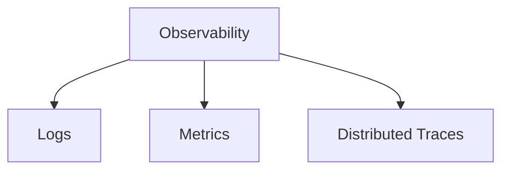

---

# 9. Observability Architecture

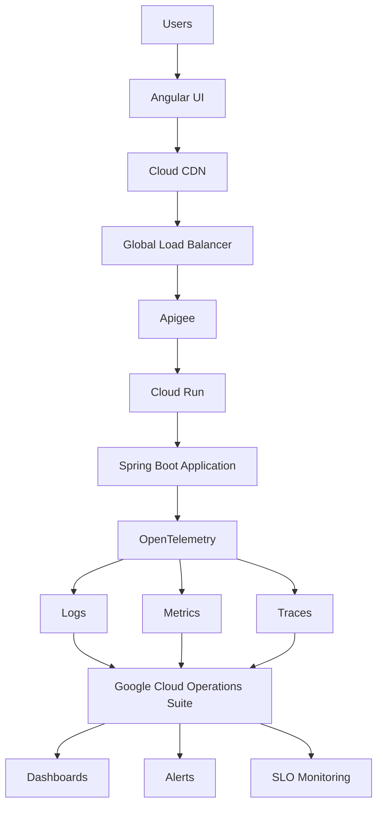

---

# 10. Component-Level Observability

## Angular

Monitor:

- JavaScript errors
- Page load time
- API failures
- User journey failures
- Browser errors
- Core Web Vitals

---

## Cloud CDN and Global Load Balancer

Monitor:

- Request count
- Request latency
- HTTP 4xx errors
- HTTP 5xx errors
- Cache hit ratio
- Backend latency

---

## Apigee

Monitor:

- API traffic
- API latency
- p95 latency
- HTTP 4xx errors
- HTTP 5xx errors
- Quota violations
- Backend latency
- API proxy failures

---

## Cloud Run

Monitor:

- Request count
- Request latency
- Container instances
- Concurrency
- CPU utilization
- Memory utilization
- HTTP 4xx errors
- HTTP 5xx errors
- Cold starts

---

## Spring Boot

Application-level metrics should include:

- JVM memory
- Garbage collection
- Thread pools
- HTTP connection pools
- Database connection pools
- Business errors
- Application latency

---

## Cloud Spanner

Monitor:

- Request latency
- CPU utilization
- Transaction latency
- Lock contention
- Errors
- Throughput

---

## Cloud SQL

Monitor:

- CPU utilization
- Memory utilization
- Database connections
- Query latency
- Disk utilization
- Replication
- Locks
- Slow queries

---

## Dataflow

Monitor:

- Pipeline failures
- Watermarks
- Backlog
- Throughput
- Worker utilization
- Processing errors
- Failed records

---

# 11. Distributed Tracing and Correlation IDs

A key architectural decision is to implement end-to-end request correlation.

Every request should be traceable across the architecture.

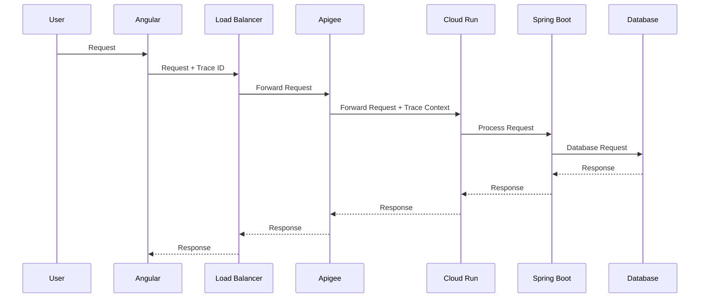

The objective is to answer questions such as:

> **Why did a particular request take four seconds?**

The trace should help identify whether latency originated from:

- Frontend
- Load balancing
- API management
- Application processing
- Database access
- Downstream services

---

# 12. Performance and Scalability Strategy

The POC should not begin with arbitrary throughput targets.

Instead:

> **The POC will establish a baseline and validate the application's scalability curve.**

---

# 13. Performance Testing Model

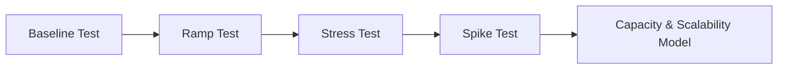

---

# 14. Performance Testing Phases

## Phase 1 — Baseline Test

Example initial workload:

```text
100 RPS
```

Measure:

- p50 latency
- p95 latency
- p99 latency
- CPU utilization
- Memory utilization
- Error rate

---

## Phase 2 — Ramp Test

Gradually increase load.

Example:

```text
100 RPS
  ↓
500 RPS
  ↓
1,000 RPS
  ↓
2,500 RPS
```

The objective is to identify:

- Latency degradation
- Scaling behavior
- Resource saturation
- Database bottlenecks

---

## Phase 3 — Stress Test

Increase load until the application begins to degrade.

The objective is to identify:

> **Maximum Sustainable Throughput**

---

## Phase 4 — Spike Test

Simulate sudden traffic increases.

Example:

```text
100 RPS
   ↓
5,000 RPS
```

Validate:

- Cloud Run scaling
- Apigee capacity
- Database capacity
- Connection pools
- Recovery after the spike

---

# 15. Performance Measurements

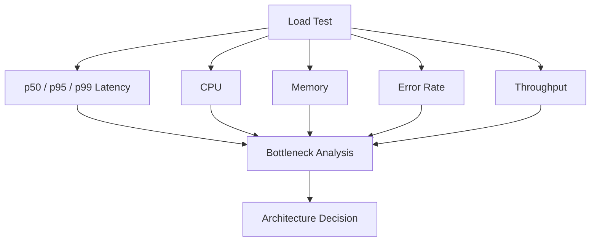

---

# 16. Cloud Run Performance Strategy

Cloud Run configuration should be driven by testing.

## Key Parameters

| Parameter | POC Approach | Production Decision |
|---|---|---|
| CPU | Establish baseline | Load-test driven |
| Memory | Establish baseline | JVM profile driven |
| Concurrency | Test multiple values | Throughput driven |
| Min Instances | Measure startup behavior | SLO/RTO driven |
| Max Instances | Controlled testing | Capacity driven |
| Startup Time | Measure | Optimize |

A key architecture principle:

> **Cloud Run concurrency should not be selected based on guesswork.**

Instead:

> **Concurrency configuration should be determined through performance testing using p95/p99 latency, CPU utilization, memory utilization, JVM behavior, and downstream database capacity.**

---

# 17. Long-Term Performance Strategy

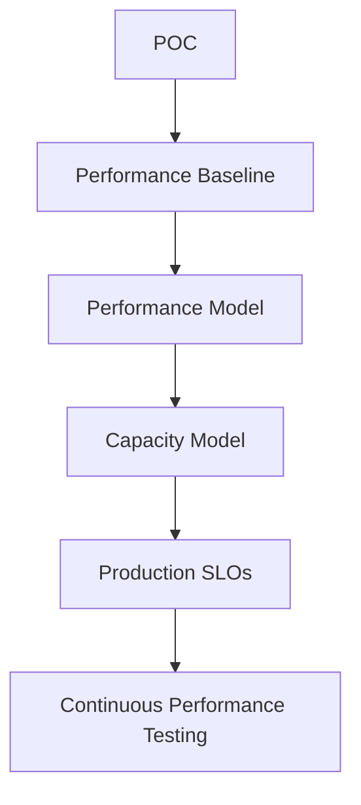

---

# 18. Performance Testing in CI/CD

Performance validation should progressively become part of the delivery process.

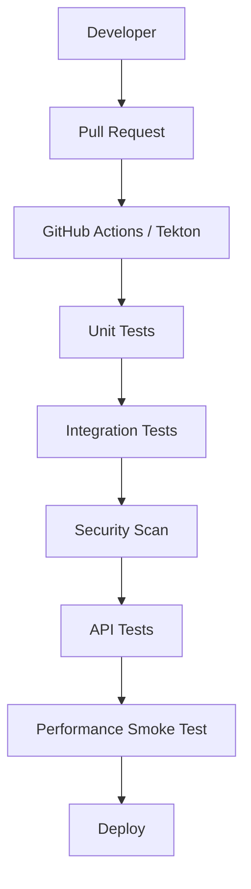

Periodic testing should also be performed.

```text
Weekly Load Test
        ↓
Performance Dashboard
        ↓
Compare With Baseline
        ↓
Identify Regression
```

---

# 19. Quality Engineering Strategy

Software quality should be validated using multiple testing layers.

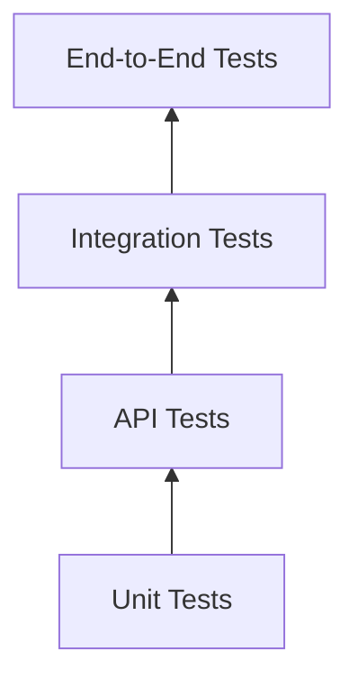

---

# 20. Frontend Quality

For Angular:

- Unit tests
- Component tests
- UI tests
- End-to-end tests
- Accessibility tests

---

# 21. Backend Quality

For Spring Boot:

- Unit tests
- Integration tests
- API tests
- Contract tests
- Database tests

---

# 22. CI/CD Quality Gates

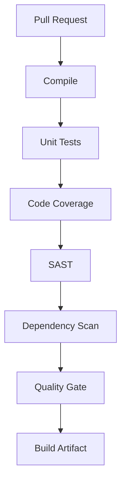

After deployment:

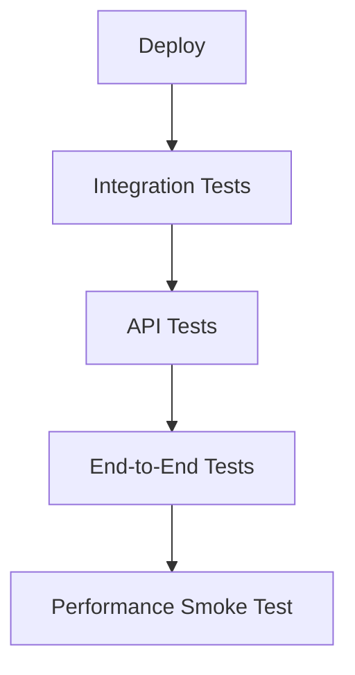

---

# 23. Quality Targets

| Quality Metric | POC | Production |
|---|---|---|
| Unit tests | Establish baseline | Defined target |
| Critical business logic | Identify | Targeted coverage |
| Critical API tests | Identify | 100% |
| Critical user journeys | Top journeys | All critical journeys |
| Critical vulnerabilities | 0 | 0 |
| High vulnerabilities | Review | Defined remediation SLA |
| API error rate | Measure | Defined SLO |

A key principle:

> **Code coverage is a supporting metric. Critical business logic and high-risk components require targeted test coverage regardless of aggregate coverage percentage.**

---

# 24. Reliability Strategy

Reliability should be designed across three areas:

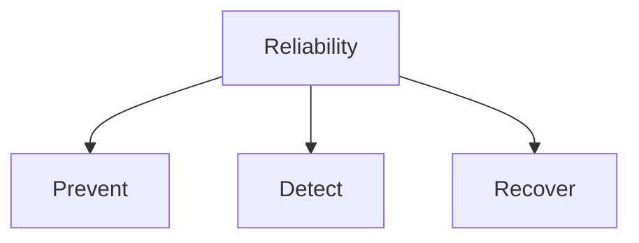

---

## Prevent

Examples:

- Autoscaling
- Health checks
- Timeouts
- Retries
- Rate limiting
- Circuit breakers
- Input validation

---

## Detect

Examples:

- Monitoring
- Alerts
- SLOs
- Error budgets
- Distributed tracing

---

## Recover

Examples:

- Rollback
- Restart
- Failover
- Backup
- Disaster recovery
- Operational runbooks

---

# 25. RTO and RPO Strategy

RTO and RPO requirements must become architecture decisions.

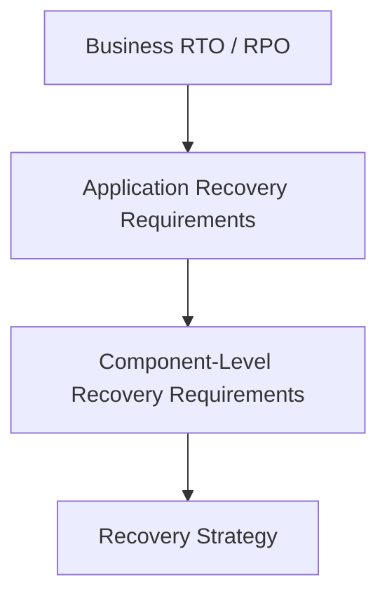

---

# 26. Component Recovery Matrix

The actual values should come from approved business requirements.

| Component | RTO | RPO | Recovery Strategy |
|---|---|---|---|
| Angular | Defined | N/A | Redeploy |
| Cloud Run | Defined | N/A | Multi-instance recovery |
| Apigee | Defined | N/A | Managed service capability |
| Cloud Spanner | Defined | Defined | Backup and recovery strategy |
| Cloud SQL | Defined | Defined | HA and replication strategy |
| Cloud Storage | Defined | Defined | Replication and versioning strategy |
| Dataflow | Defined | Defined | Restart and reprocessing strategy |

> **Do not assign RTO or RPO values based on assumptions. Use approved business requirements.**

---

# 27. SLO and SLI Framework

This is one of the most important parts of the operational architecture.

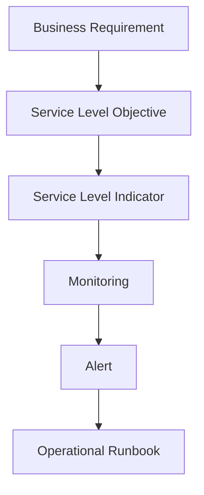

---

# 28. Example: API Availability

## Service Level Objective

```text
99.9% availability
```

## Service Level Indicator

```text
Successful Requests / Total Requests
```

## Alert

```text
Error budget burn rate exceeds the defined threshold.
```

## Example Runbook

```text
1. Check Apigee health and error rates.

2. Check Cloud Run health and recent scaling behavior.

3. Check application logs.

4. Check downstream services and databases.

5. Check recent deployments.

6. Roll back if required.
```

This approach is stronger than simply:

> "Create an alert when 5xx errors increase."

---

# 29. Operational Readiness Model

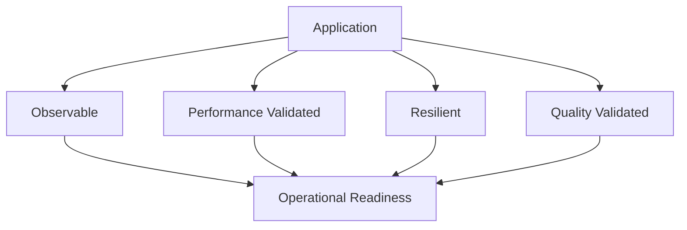

The application should be considered operationally ready only when critical requirements have:

- Architecture implementation
- Defined metrics
- Monitoring
- Alerts
- Validation tests
- Recovery procedures
- Operational ownership

---

# 30. Recommended Deliverables

## Deliverable 1 — Architecture Strategy

Suggested structure:

```text
1. Executive Summary

2. Scope

3. Architecture Overview

4. Requirements
   - Functional Requirements
   - Non-Functional Requirements
   - RTO / RPO

5. Architecture Principles

6. Observability Strategy

7. Performance & Scalability Strategy

8. Reliability & Resilience Strategy

9. Quality Engineering Strategy

10. Disaster Recovery Strategy

11. SLO / SLI Framework

12. POC Roadmap

13. Production Roadmap

14. Risks and Open Decisions
```

---

## Deliverable 2 — NFR Traceability Matrix

This document demonstrates:

> **Every critical requirement has an architecture decision and a validation strategy.**

Example:

| ID | Requirement | Architecture | Metric | Validation |
|---|---|---|---|---|
| PERF-01 | p95 < X ms | Cloud Run scaling | p95 latency | Load test |
| REL-01 | Availability target | Multi-instance design | Availability | SLO |
| DR-01 | RTO = X | Recovery strategy | Recovery time | DR test |
| DR-02 | RPO = X | Backup strategy | Data loss | DR test |
| OBS-01 | Traceability | OpenTelemetry | Trace coverage | Test |

---

## Deliverable 3 — POC Roadmap

---

# 31. POC Roadmap

## Week 1 — Requirements and Architecture

- NFR analysis
- RTO/RPO mapping
- Define initial SLIs and SLOs
- Identify architecture decisions

---

## Week 2 — Observability

- Logging strategy
- Metrics strategy
- Distributed tracing
- Dashboard design
- Initial alerts

---

## Week 3 — Performance Baseline

- Baseline performance testing
- Cloud Run tuning
- Database baseline
- Identify initial bottlenecks

---

## Week 4 — Scalability Validation

- Load testing
- Stress testing
- Spike testing
- Bottleneck analysis

---

## Week 5 — Quality Engineering

- Quality gates
- CI/CD strategy
- Automated testing
- Security validation

---

## Week 6 — Architecture Findings

- POC findings
- Performance baseline
- Architecture recommendations
- Risks and open decisions
- Production readiness roadmap

---

# 32. Long-Term Roadmap

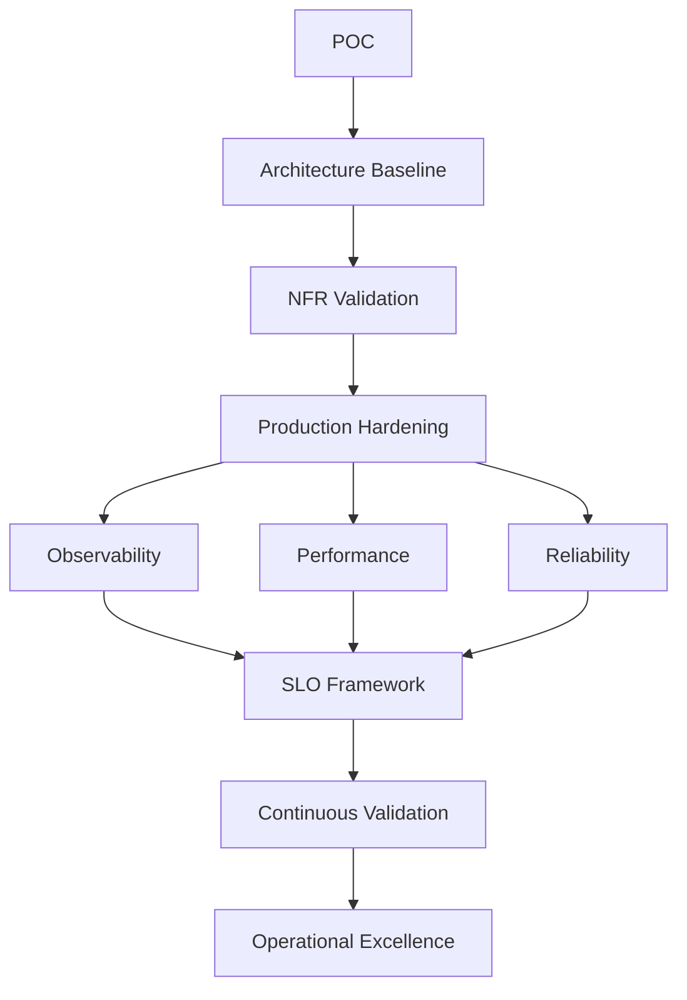

---

# 33. Long-Term Architecture Capabilities

## Observability

- Dashboards
- Distributed tracing
- SLO monitoring
- Error budgets
- Automated alerts
- Operational runbooks

## Performance

- Capacity modeling
- Load testing
- Stress testing
- Performance regression testing
- Autoscaling strategy

## Quality

- Automated testing
- Contract testing
- Security gates
- Code quality validation
- Release quality gates

## Reliability

- Disaster recovery testing
- Failure testing
- Backup validation
- Recovery automation
- Game days

---

# 34. Architecture Assurance Framework

The overall architecture assurance model can be summarized as:

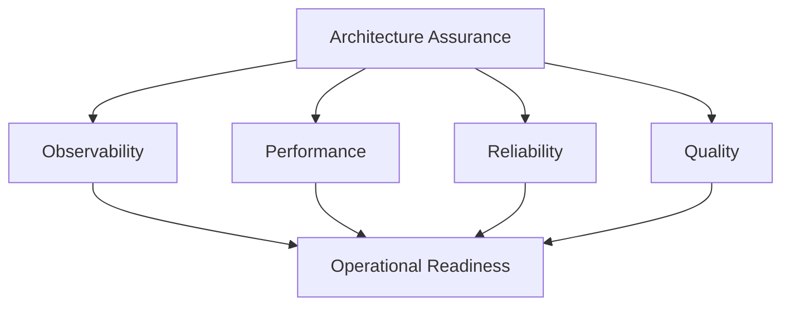

---

# 35. Key Architectural Principle

The objective is not to demonstrate knowledge of individual technologies.

The objective is to demonstrate that technology decisions are driven by requirements and validated with measurable evidence.

```text
Requirement
      ↓
Architecture Decision
      ↓
Implementation
      ↓
Measurement
      ↓
Validation
      ↓
Operational Readiness
```

---

# 36. Final Positioning

The architecture approach should be presented as an **Architecture Assurance Framework**, rather than simply a monitoring or performance testing initiative.

The core message is:

> **I am establishing a measurable architecture assurance framework where every critical non-functional requirement has an architectural implementation, an operational metric, and a validation mechanism.**

This provides a structured approach to ensuring that the application is:

- Observable
- Performant
- Scalable
- Reliable
- Resilient
- Testable
- Recoverable
- Operationally ready

---

# 37. Success Criteria

The POC will be successful when it produces evidence that supports future production architecture decisions.

```mermaid
flowchart LR

    POC[POC Validation]

    POC --> ARCH[Architecture Decisions]
    POC --> PERF[Performance Baselines]
    POC --> OBS[Observability Baselines]
    POC --> REL[Reliability Strategy]

    ARCH --> PROD[Production Architecture]
    PERF --> PROD
    OBS --> PROD
    REL --> PROD
```

## Final Outcome

> **The POC should provide measurable evidence for production decisions related to scalability, capacity, performance, resilience, disaster recovery, software quality, and operational readiness.**

---

## Core Architecture Message

> **Requirement → Architecture Decision → Implementation → Measurement → Validation → Operational Readiness**

This is the central framework for architect-level ownership of the application.